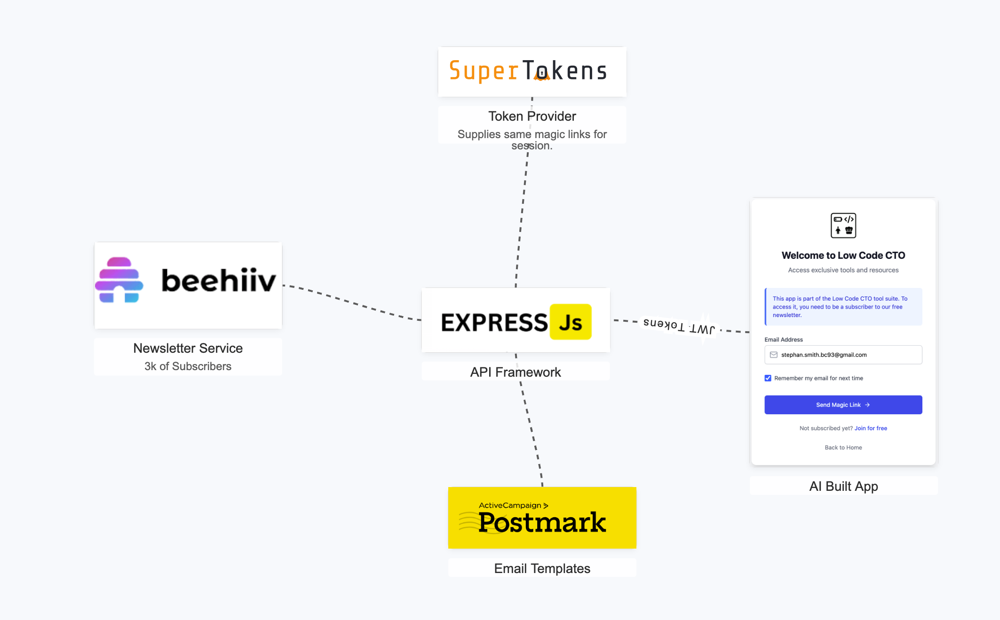
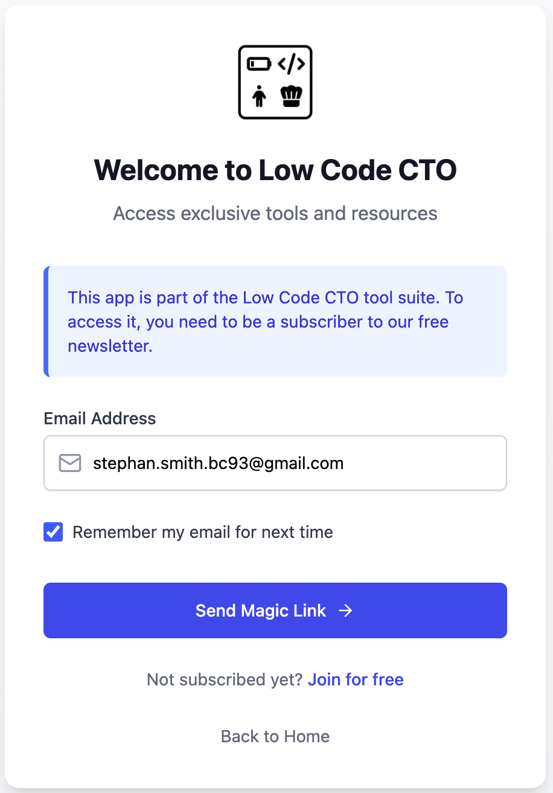
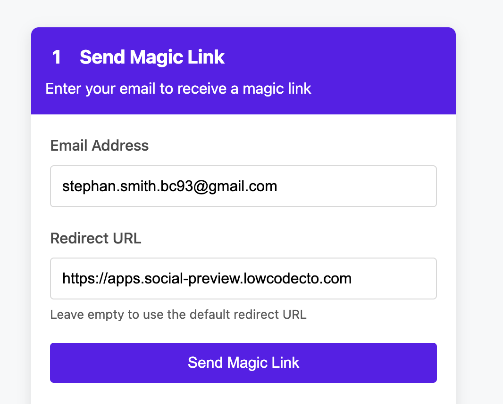

# How to use Beehiiv as an Auth Provider

A backend Node.js Express application that provides magic link authentication via SuperTokens, verifying email access via the Beehiiv API before sending a magic link. Once authenticated, it issues JWT tokens and manages sessions using PostgreSQL.

Read more about it on my [Low Code CTO - Beehiiv as an Identity Provider](https://lowcodecto/p/beehiiv-as-my-login). I explain
the Low Code approach to using Beehiiv and not Firebase Auth, Auth0, Okta or any number of other solutions.

## Screenshots

<a href="assets/stack.png" target="_blank">
   
</a>
<a href="assets/ui.png" target="_blank">
   
</a>
<a href="assets/api-test-harness.png" target="_blank">
   
</a>


## Business Need

I have come to believe that every part of a companies technology stack needs to be 
aligned to revenue and to the users experience. I have a growing newsletter of Beehiiv.
I wanted and needed a low tech way to limited access to the suite of mini apps that 
I offer my paying users. (there has to be some value for paying to read a newsletter :))

This solution, while not no-code, is super light weight. This a little help anyone can
adapt and use this to drive value outside of their core content on Beehiiv.

(Now, if Beehiiv was creative, this might be a good feature to add for content 
creators.)

## Low Code vs No-Code
This is not no-code. Sad. But it meets my requirements. It takes code and complexity
out of the solution, by using the smallest amount possible. A first 
## Security Warnings

Using magic links is not the most secure way to limit access to anything. On the 
secuirty sprectum, its not secure. But security needs to meet the need. For my needs
this is perfect light weight solution. It is very scalable. Its very user friendly.
and it cheap.

Cheap is good!

One last comment on security. I do not create the single-use URLs, SuperTokens
does. This is their business.

## Features

- **Magic Link Authentication**: Uses SuperTokens Passwordless for authentication
- **Beehiiv Integration**: Verifies if an email belongs to a Beehiiv subscriber before sending a magic link
- **JWT Token Issuance**: Generates custom JWT tokens for authorized clients
- **Hosting**: Hosted on Render.com
- **Subscription Verification**: Periodically re-checks Beehiiv subscription status

## Tech Stack

- Node.js + Express.js
- SuperTokens for authentication
- JWT for token management
- Beehiiv API integration (Render.com)
- TypeScript
- Email - Postmark.com

## Prerequisites

- Node.js (v18 or higher)
- PostgreSQL database (via Railway or any other provider)
- SuperTokens account (or self-hosted instance)
- Beehiiv account with API access

## Installation

1. Clone the repository:
   ```
   git clone <repository-url>
   cd beehiiv-app-auth
   ```

2. Install dependencies:
   ```
   npm install
   ```

3. Create a `.env` file based on `.env.example`:
   ```
   cp .env.example .env
   ```

4. Update the environment variables in the `.env` file with your actual values:
   - Configure your JWT secret
   - Set your SuperTokens connection URI and API key
   - Add your Beehiiv API key and publication ID

## Development

Start the development server with auto-reload:

```
npm run dev
```

## Production Build

Build the TypeScript code:

```
npm run build
```

Start the production server:

```
npm start
```

**Node Environment Variables**
Review the `.env.example` file for the values you need to define.

## API Endpoints

- `POST /auth/login` - Use email to generate a magic link.
- `POST /auth/callback` - Handles successful authentication with SuperTokens
- `GET /auth/verify` - Verifies JWT token and checks subscription status
- `POST /auth/refresh` - Refreshes expired JWT tokens

## Integration with Frontend

In your frontend application, redirect users to the SuperTokens hosted authentication page:

```javascript
window.location.href = `${API_URL}/auth/signin?redirect_uri=${encodeURIComponent(CALLBACK_URL)}`;
```

After successful authentication, users will be redirected back to your application with a JWT token:

```javascript
// Extract token from URL query parameter
const urlParams = new URLSearchParams(window.location.search);
const token = urlParams.get('token');

// Store token in local storage
localStorage.setItem('authToken', token);
```

Use the token for authenticated API requests:

```javascript
fetch('https://your-api.com/protected-endpoint', {
  headers: {
    'Authorization': `Bearer ${localStorage.getItem('authToken')}`
  }
})
```

## License

[MIT License](LICENSE)